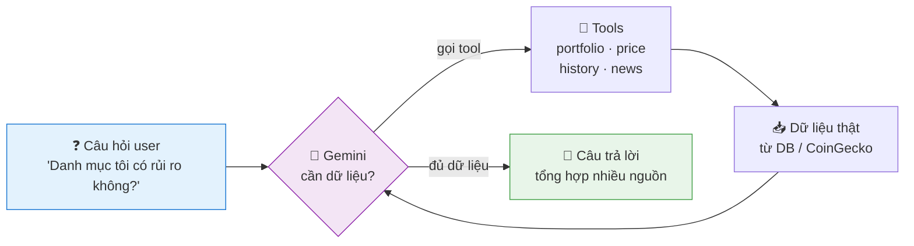
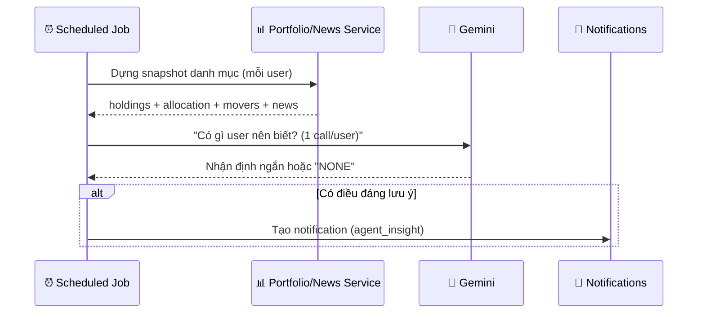
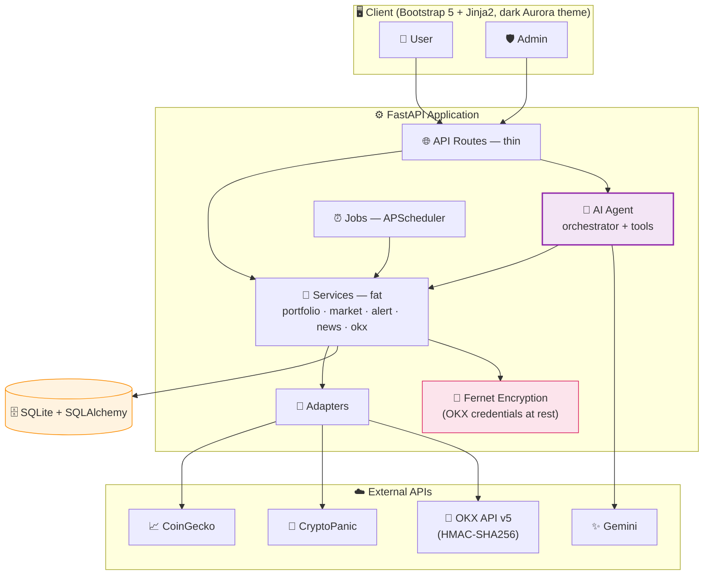

<div align="center">

# 🚀 CryptoPilot

### Quản lý danh mục crypto cá nhân — tích hợp **AI Agent** thực thụ

*Đồ án cuối kỳ môn Software Engineering for AI*


</div>

---

## 📑 Mục lục

- [Giới thiệu](#-giới-thiệu)
- [Điểm nhấn: AI Agent](#-điểm-nhấn-ai-agent)
- [Kiến trúc tổng thể](#-kiến-trúc-tổng-thể)
- [Actors](#-actors)
- [Tính năng](#-tính-năng)
- [Tech Stack](#-tech-stack)
- [Cấu trúc thư mục](#-cấu-trúc-thư-mục)
- [Cài đặt & Chạy](#-cài-đặt--chạy)
- [Tài liệu kỹ thuật](#-tài-liệu-kỹ-thuật)
- [Phạm vi dự án](#-phạm-vi-dự-án)

---

## 🎯 Giới thiệu

**CryptoPilot** là web app giúp **nhà đầu tư crypto cá nhân, không chuyên** theo dõi danh mục mà
không cần ngồi canh giá liên tục. Người dùng nhập giao dịch thủ công hoặc **đồng bộ tự động từ
sàn OKX**, hệ thống tự tính lãi/lỗ theo giá thị trường real-time, và quan trọng nhất — một
**AI Agent** đóng vai trợ lý phân tích: trả lời câu hỏi về danh mục, cảnh báo rủi ro, lọc tin tức
và chủ động báo khi phát hiện điều đáng lưu ý.

Dự án giải quyết **4 nỗi đau** của nhà đầu tư cá nhân:

| 😟 Nỗi đau | 💡 CryptoPilot giải quyết |
|---|---|
| Không biết khi nào nên lo cho danh mục | AI Agent phân tích rủi ro tập trung, xu hướng, lãi/lỗ |
| Quá tải tin tức crypto | Agent lọc tin **chỉ liên quan coin bạn đang giữ** |
| Không có thời gian canh giá | Job nền theo dõi giá + cảnh báo chủ động |
| Nhập tay giao dịch mất công, dễ sai | Đồng bộ tự động từ ví **OKX** (chỉ quyền đọc, không cần nhập tay) |

---

## 🤖 Điểm nhấn: AI Agent

Khác với chatbot thường (trả lời bằng kiến thức có sẵn, dễ **bịa số**), Agent của CryptoPilot **tự
quyết định cần dữ liệu gì → gọi tool lấy dữ liệu thật → tổng hợp**. Đây là vòng **ReAct** với
**Function Calling** — trọng tâm học thuật của đồ án.



Agent chạy **2 chế độ**:
- **Reactive** — trả lời khi user chat (vòng ReAct theo yêu cầu)
- **Proactive** — tự chạy theo lịch, phát hiện rủi ro/tin quan trọng và cảnh báo *không cần được hỏi*



---

## 🏗️ Kiến trúc tổng thể

Phân tầng rõ ràng: **route (thin) → service (fat) → adapter / model**. AI Agent là tầng riêng,
gọi xuống service chứ không chạm DB trực tiếp. Mọi call ra ngoài đều **async** + bọc **Adapter**
(bao gồm cả kết nối sàn OKX ở Phase 8).



---

## 👥 Actors

| Actor | Vai trò |
|---|---|
| 👤 **User** | Nhập giao dịch (thủ công hoặc đồng bộ OKX), xem danh mục & lãi/lỗ, chat với Agent, đặt cảnh báo, nhận thông báo |
| 🛡️ **Admin** | Xem thống kê hệ thống, quản lý users, cấu hình ngưỡng cảnh báo mặc định |
| 🤖 **AI Agent** | *Actor độc lập:* tự gọi tools để lấy dữ liệu, phân tích danh mục, **chủ động** cảnh báo |

> AI Agent được liệt kê như một **actor** vì nó **tự hành động**, không chỉ phản ứng thụ động như một API.

---

## ✨ Tính năng

**📊 Quản lý danh mục**
- Nhập giao dịch mua/bán (coin, số lượng, giá, ngày)
- Tự tính holdings + giá vốn trung bình + lãi/lỗ real-time
- Tỷ trọng phân bổ danh mục, so sánh hiệu suất với Bitcoin

**💼 Ví OKX** *(Phase 8)*
- Kết nối tài khoản OKX qua API key — chỉ cần quyền **Đọc** (Read-only), không cần Trade/Withdraw
- Đồng bộ tự động lịch sử giao dịch → tạo Transaction tương ứng, không cần nhập tay
- Đồng bộ lại nhiều lần không bị trùng lặp (dedupe qua bảng `okx_synced_fills`)
- Credentials (API key/secret/passphrase) **mã hóa Fernet tại rest**, không bao giờ trả về trong API response

**🤖 Trợ lý AI (Agent)**
- Chat phân tích danh mục (vòng ReAct, function calling)
- Lọc tin tức crypto **chỉ liên quan coin bạn giữ**
- Chủ động cảnh báo rủi ro mà không cần được hỏi

**🔔 Cảnh báo & theo dõi**
- Đặt ngưỡng giá (above/below) cho coin quan tâm
- Job nền kiểm tra giá định kỳ → thông báo khi chạm ngưỡng
- Hộp thông báo thống nhất (cảnh báo giá + nhận định Agent)

**🎨 Giao diện** *(Phase 7)*
- Design system riêng (`theme.css`) — dark mode, Aurora gradient (magenta → violet → cyan)
- Home hub cá nhân hóa: số liệu danh mục thật, truy cập nhanh mọi tính năng
- Đồng bộ giao diện trên toàn bộ trang (danh mục, cảnh báo, agent, admin, auth)

**🔐 Tài khoản**
- Đăng ký / đăng nhập, xác thực JWT qua httpOnly cookie
- Admin: khóa/mở tài khoản, cấp quyền admin, cấu hình hệ thống runtime

---

## 🛠️ Tech Stack

| Thành phần | Lựa chọn | Lý do |
|---|---|---|
| Ngôn ngữ | **Python 3.11+** | Ecosystem AI mạnh nhất, cú pháp gọn, hợp sinh viên |
| Backend | **FastAPI** | Async tốt (quan trọng khi gọi API ngoài), docs rõ, học nhanh |
| Frontend | **Bootstrap 5 + Jinja2** | Server-rendered, đủ cho MVP, giảm độ phức tạp |
| Database | **SQLite + SQLAlchemy** | Không cần cài server, đủ cho scope đồ án |
| AI Agent | **Google Gemini** (`google-genai`) | Free tier + hỗ trợ Function Calling, dễ deploy |
| Dữ liệu thị trường | **CoinGecko API** | Free Demo tier, không cần tài khoản sàn |
| Tin tức | **CryptoPanic API** | Lọc tin theo coin (param `currencies`), có free tier |
| Sàn giao dịch | **OKX API v5** (HMAC-SHA256) | Đồng bộ giao dịch thật, chỉ cần Read-only key |
| Mã hóa | **Fernet** (`cryptography`) | Lưu credentials OKX an toàn tại rest, không hardcode |
| Lập lịch | **APScheduler** | Job nền: kiểm tra giá, proactive, refresh cache |
| Auth | **JWT** (httpOnly cookie) | Hợp app server-rendered |
| QA | `ruff` · `mypy` · `pytest` | Lint, type-check, 100 test tự động |

---

## 📁 Cấu trúc thư mục

```
app/
├── main.py               # FastAPI app + khởi động APScheduler
├── core/                 # config, security (JWT), database, encryption (Fernet)
├── models/                # user, coin, transaction, alert, chat, notification,
│                          # setting, okx_connection, okx_synced_fill
├── schemas/               # Pydantic request/response (auth, market, alert, chat, okx)
├── api/                    # routes (thin) — auth, portfolio, market, alerts,
│                          # agent, admin, wallet (OKX)
├── services/               # business logic (fat) — portfolio, market, alert, news,
│                          # admin, settings, okx_service
├── adapters/               # CoinGecko, CryptoPanic, OKX (adapter pattern, dễ thay provider)
├── agent/                  # 🤖 orchestrator, tools, prompts, gemini_client
└── jobs/                   # price_check, proactive_agent, refresh_coins, scheduler
templates/                 # Jinja2 + Bootstrap 5 — dark Aurora theme (Phase 7)
static/css/                # app.css, theme.css (design system)
tests/                     # pytest — 100 test (unit + service + route)
requirements.txt · .env.example · README.md
```

---

## ⚡ Cài đặt & Chạy

**1. Clone & tạo môi trường ảo**
```bash
git clone <repo-url> && cd cryptopilot
python -m venv venv
source venv/bin/activate        # Windows: venv\Scripts\activate
pip install -r requirements.txt
```

**2. Lấy API keys**
- 🔑 **CoinGecko** *(miễn phí)* — đăng ký Demo API key tại coingecko.com/en/api/pricing
- 🔑 **Gemini** *(miễn phí, bắt buộc)* — tạo key tại Google AI Studio
- 🔑 **CryptoPanic** *(miễn phí, tùy chọn)* — đăng ký lấy `auth_token` trong dashboard
- 🔑 **OKX** *(tùy chọn, để dùng tính năng đồng bộ ví)* — vào OKX → Tài khoản → API →
  tạo key mới với **chỉ quyền Đọc (Read)** — **không** tick Trade/Withdraw, nên bật IP Whitelist

**3. Generate `ENCRYPTION_KEY`** (bắt buộc nếu dùng tính năng Ví OKX)
```bash
python -c "from cryptography.fernet import Fernet; print(Fernet.generate_key().decode())"
```

**4. Cấu hình `.env`** (copy từ `.env.example`)
```env
COINGECKO_BASE_URL=https://api.coingecko.com/api/v3
COINGECKO_DEMO_KEY=your_key

GEMINI_API_KEY=your_key
GEMINI_MODEL=gemini-2.5-flash

CRYPTOPANIC_BASE_URL=https://cryptopanic.com/api/developer/v2
CRYPTOPANIC_TOKEN=your_token

JWT_SECRET=your_random_secret
JWT_EXPIRE_MINUTES=60

DATABASE_URL=sqlite:///./cryptopilot.db

ENCRYPTION_KEY=your_generated_fernet_key   # từ bước 3, cần cho Ví OKX

# Scheduler / Jobs — đều có default hợp lý, có thể bỏ qua
ENABLE_SCHEDULER=true
ALERT_CHECK_INTERVAL_MINUTES=10
PROACTIVE_INTERVAL_HOURS=6
REFRESH_COINS_INTERVAL_HOURS=24
```
> Chỉ `GEMINI_API_KEY` là bắt buộc để Agent hoạt động. Thiếu `CRYPTOPANIC_TOKEN` thì phần tin
> tức trả rỗng (graceful). Thiếu `ENCRYPTION_KEY` thì trang `/wallet` sẽ lỗi khi kết nối OKX —
> các tính năng khác không bị ảnh hưởng.

**5. Chạy**
```bash
uvicorn app.main:app --reload
```
> Mở http://127.0.0.1:8000 — đăng ký tài khoản, nhập vài giao dịch, rồi thử chat với Agent.

**6. Cấp quyền admin** (để vào `/admin`)
```bash
python -c "from app.core.database import SessionLocal; from app.models.user import User; from sqlalchemy import select; db=SessionLocal(); u=db.execute(select(User).where(User.email=='your@email.com')).scalars().first(); u.is_admin=True; db.commit(); print('promoted', u.email)"
```

**7. Chạy test**
```bash
ruff check app tests && ruff format --check app tests && mypy app --ignore-missing-imports && pytest -q
```
> Kỳ vọng: **100 passed**.

### 🎬 Demo flow gợi ý
1. **Đăng ký / đăng nhập** → vào **Danh mục**, thêm vài giao dịch (mua BTC, ETH...).
2. **Trợ lý AI** (`/agent`): hỏi *"Danh mục tôi có rủi ro không?"* → xem Agent gọi tool
   (`get_portfolio_allocation`...) ở mục "🔧 Agent đã gọi N tool" rồi tổng hợp — đây là vòng ReAct.
3. **Cảnh báo** (`/alerts`): tìm coin qua ô search → đặt ngưỡng → chạy job
   `python -c "import asyncio; from app.jobs.price_check import price_check; asyncio.run(price_check())"`
   → **Thông báo** tự hiện (badge 🔔).
4. **Proactive**: `python -c "import asyncio; from app.jobs.proactive_agent import proactive_agent; asyncio.run(proactive_agent())"`
   → Agent tự tạo nhận định rủi ro mà user không cần hỏi.
5. **Ví OKX** (`/wallet`, cần `ENCRYPTION_KEY` + API key OKX thật): nhập API key/secret/passphrase
   (quyền Đọc) → **Kết nối** → **Đồng bộ** → giao dịch từ sàn tự xuất hiện trong Danh mục.
6. **Quản trị** (`/admin`, cần admin): xem thống kê hệ thống, quản lý user, chỉnh cấu hình
   (ngưỡng cảnh báo mặc định, bật/tắt proactive).
7. **Biểu đồ hiệu suất** (`/portfolio`, panel "Hiệu suất vs Bitcoin"): mỗi khung 7D/30D/
   90D/1Y chỉ mở khóa khi đã có đủ số ngày `portfolio_snapshots` thật liên tục (job
   `portfolio_snapshot` chạy 1 lần/ngày). Để demo nhanh không cần đợi hàng tháng:
   `python -m app.dev_tools.seed_portfolio_history --email you@example.com --days 365`
   ⚠️ Script demo-only (`app/dev_tools/`, không phải job production, không tự chạy) —
   không ghi đè dữ liệu thật. Xoá các dòng giả trước khi nộp báo cáo nếu cần
   `portfolio_snapshots` sạch 100% dữ liệu thật.

---

## 📚 Tài liệu kỹ thuật

| File | Nội dung |
|---|---|
| [01-overview.md](_docs/01-overview.md) | Tổng quan, mục tiêu, tech stack, actors |
| [02-phases.md](_docs/02-phases.md) | Lộ trình phát triển theo phase (8/8 hoàn thành) |
| [03-database.md](_docs/03-database.md) | Schema database (users, transactions, alerts, notifications, chat) |
| [04-architecture.md](_docs/04-architecture.md) | Kiến trúc, phân tầng, adapter & service, async/sync, JWT |
| [05-ai-agent.md](_docs/05-ai-agent.md) | 🤖 Thiết kế AI Agent: tools, system prompt, ReAct, proactive |
| [06-api-integration.md](_docs/06-api-integration.md) | Tích hợp CoinGecko, Gemini, CryptoPanic |
| [07-alerts-jobs.md](_docs/07-alerts-jobs.md) | Cảnh báo & scheduled jobs (APScheduler) |

---

## 🎯 Phạm vi dự án

<table>
<tr><th>✅ Trong phạm vi (MVP)</th><th>❌ Ngoài phạm vi</th></tr>
<tr><td valign="top">

- Nhập giao dịch thủ công + tính lãi/lỗ
- AI Agent phân tích danh mục (reactive + proactive)
- Lọc tin tức theo coin đang giữ
- Cảnh báo ngưỡng giá
- Kết nối ví OKX **(chỉ đọc)** — đồng bộ giao dịch tự động
- Admin cơ bản (cờ `is_admin`)

</td><td valign="top">

- Tự động **giao dịch** thay user (đặt lệnh mua/bán qua Agent)
- Kết nối sàn khác ngoài OKX
- Futures / Derivatives / DeFi
- Thanh toán, gói trả phí
- Mobile app

</td></tr>
</table>

---

<div align="center">

*CryptoPilot — đồ án học thuật. Mọi nhận định của AI Agent mang tính tham khảo, không phải lời khuyên đầu tư.*

</div>
